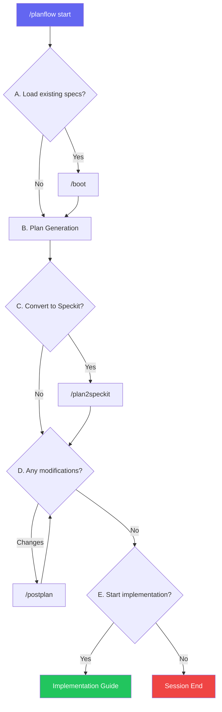

# Claude Code Planflow Skills

[한국어 문서 (Korean)](README_KO.md)

## Table of Contents

1. [Introduction](#introduction)
2. [Installation](#installation)
3. [Quick Start](#quick-start)
4. [Commands](#commands)
5. [Workflow](#workflow)
6. [Test Results](#test-results)
7. [Speckit Format](#speckit-format)
8. [Customization](#customization)
9. [Troubleshooting](#troubleshooting)

---

## Introduction

### What is Planflow Skills?

Planflow Skills is a custom slash command package for Claude Code. It enables an interactive workflow for feature development: **Plan → Structure (Speckit) → Feedback → Implement**.

### Key Features

- **Interactive Workflow**: Flexible progress with yes/no choices at each step
- **Speckit Compatible**: Supports GitHub Spec Kit standard format
- **Modular**: Use the full workflow or individual commands
- **Feedback Loop**: Iteratively improve plans before implementation

### Why Use Planflow?

| Traditional Approach | With Planflow |
|---------------------|---------------|
| Start coding immediately → Frequent restructuring | Plan first → Systematic implementation |
| Plans only in your head | Documented plan.md, tasks.md |
| Hard to track progress | Progress tracking with checklists |
| Difficult to share with team | Easy sharing with standard format |

---

## Installation

### Requirements

- Claude Code CLI installed
- Write permissions to project directory

### Installation Methods

#### Method 1: Per-project Installation (Recommended)

```bash
# Clone repository
git clone https://github.com/devload/claude-planflow-skills.git

# Copy to your project
cp -r claude-planflow-skills/.claude/commands/ /your/project/.claude/commands/
```

#### Method 2: Global Installation

```bash
# Copy to home directory's .claude folder
cp -r .claude/commands/ ~/.claude/commands/
```

### Verify Installation

In Claude Code, run:

```
/planflow --help
```

---

## Quick Start

### 5-Minute Tutorial

1. **Navigate to project directory**
   ```bash
   cd /path/to/your/project
   ```

2. **Run Claude Code**
   ```bash
   claude
   ```

3. **Start Planflow**
   ```
   /planflow user-auth "Implement JWT-based authentication system"
   ```

4. **Respond to prompts**
   - "Load existing specs?" → `no`
   - (Plan is generated)
   - "Convert to Speckit?" → `yes`
   - "Any modifications?" → `no`
   - "Start implementation?" → `yes`

5. **Start implementing!**

---

## Commands

### /planflow

Main workflow command. Guides you through the entire planning process interactively.

```
/planflow <feature-name> "<description>"
```

**Parameters**:
- `feature-name`: Feature name (kebab-case, e.g., `user-auth`, `payment-system`)
- `description`: Description of the feature to implement

**Examples**:
```
/planflow dashboard "Admin dashboard with real-time statistics"
/planflow api-rate-limit "Implement API request rate limiting"
```

**Workflow Steps**:

| Step | Question | On Yes | On No |
|------|----------|--------|-------|
| A | Load existing specs? | Run /boot | Continue |
| B | (Plan generation) | - | - |
| C | Convert to Speckit? | Run /plan2speckit | Skip |
| D | Any modifications? | Run /postplan | Skip |
| E | Start implementation? | Show guide | Exit |

---

### /boot

Load and summarize existing specs and tasks.

```
/boot [feature-name]
```

**Parameters**:
- `feature-name`: (Optional) Load specific feature only. Omit to scan all.

**Examples**:
```
/boot                  # Load all features
/boot user-auth        # Load specific feature
```

**Output Example**:
```
## Loaded Specs Summary

### user-auth
**Plan Summary**: JWT-based authentication system
**Technical Context**: TypeScript, Express, PostgreSQL
**Tasks**: 3/8 completed (5 pending)
**Next Task**: T-1.4: Implement token refresh endpoint
```

---

### /plan2speckit

Convert a plan file to Speckit format.

```
/plan2speckit <feature-name>
```

**Parameters**:
- `feature-name`: (Required) Name of feature to convert

**Input**: `plans/<feature>-YYYYMMDD-HHMM.md`

**Output**:
```
specs/<feature>/
├── plan.md      # Technical plan document
└── tasks.md     # Task breakdown with checklist
```

---

### /postplan

Update plan.md and tasks.md based on user feedback.

```
/postplan <feature-name> ["<feedback>"]
```

**Parameters**:
- `feature-name`: (Required) Name of feature to modify
- `feedback`: (Optional) Change request. If omitted, prompts interactively.

**Examples**:
```
/postplan user-auth
/postplan user-auth "Split T-1.2 into frontend and backend tasks"
/postplan user-auth "Remove Phase 3"
```

**Supported Changes**:
- Add/remove/split/merge tasks
- Modify dependencies
- Change tech stack
- Reorganize phases

---

## Workflow

### Flowchart



### Complete Flowchart (Text)

```
┌─────────────────────────────────────────────────────────────┐
│                    /planflow start                          │
└─────────────────────────────────────────────────────────────┘
                            │
                            ▼
┌─────────────────────────────────────────────────────────────┐
│  A. Pre-Plan Check                                          │
│  "Load existing specs? (yes/no)"                            │
└─────────────────────────────────────────────────────────────┘
         │yes                              │no
         ▼                                 │
   ┌───────────┐                          │
   │  /boot    │                          │
   └───────────┘                          │
         │                                 │
         └────────────┬────────────────────┘
                      ▼
┌─────────────────────────────────────────────────────────────┐
│  B. Plan Generation                                         │
│  - Analyze codebase                                         │
│  - Generate plan document                                   │
│  - Save to plans/<feature>-YYYYMMDD-HHMM.md                │
└─────────────────────────────────────────────────────────────┘
                      │
                      ▼
┌─────────────────────────────────────────────────────────────┐
│  C. Speckit Conversion                                      │
│  "Convert to specs/<feature>/? (yes/no)"                   │
└─────────────────────────────────────────────────────────────┘
         │yes                              │no
         ▼                                 │
   ┌─────────────┐                        │
   │/plan2speckit│                        │
   └─────────────┘                        │
         │                                 │
         └────────────┬────────────────────┘
                      ▼
┌─────────────────────────────────────────────────────────────────┐
│  D. Feedback Collection (loop)                                  │
│  "Any modifications? (no or enter changes)"                     │
└─────────────────────────────────────────────────────────────────┘
         │changes                         │no
         ▼                                 │
   ┌───────────┐                          │
   │ /postplan │──────────────────────────┤
   └───────────┘        (ask again)       │
                                          │
                      ┌───────────────────┘
                      ▼
┌─────────────────────────────────────────────────────────────┐
│  E. Start Implementation                                    │
│  "Start implementation now? (yes/no)"                       │
└─────────────────────────────────────────────────────────────┘
         │yes                              │no
         ▼                                 ▼
   ┌───────────────┐                ┌───────────────┐
   │ Implementation│                │  Session End  │
   │    Guide      │                │  (Saved)      │
   └───────────────┘                └───────────────┘
```

---

## Test Results

### Test 1: JWT Authentication Feature

Tested with `/planflow test-auth "JWT authentication feature"`.

#### Workflow Progress

| Step | Question | Choice | Result |
|------|----------|--------|--------|
| **Step A** | Load existing specs? | No | specs/ empty, continue |
| **Step B** | (Plan generation) | - | Analyzed project, generated Plan |
| **Step C** | Convert to Speckit? | Yes | Created plan.md, tasks.md |
| **Step D** | Any modifications? | No | Proceed to next |
| **Step E** | Start implementation? | No | End planning phase |

#### Generated Files

```
plans/
└── test-auth-20260104-1352.md   # 5,181 bytes

specs/
└── test-auth/
    ├── plan.md                   # 2,839 bytes
    └── tasks.md                  # 6,441 bytes
```

#### Generated Tasks Summary

| Phase | Tasks | Main Content |
|-------|-------|--------------|
| Phase 1: Foundation Setup | 4 | TypeScript config, Prisma, Express server |
| Phase 2: Core Authentication | 5 | Registration, Login, JWT generation, validation |
| Phase 3: Token Management | 4 | Middleware, token refresh, logout |
| Phase 4: Testing & Security | 4 | Unit/integration tests, Rate Limiting |
| **Total** | **17** | |

#### Verified Features

- ✅ `/boot` - Scan specs directory and output summary
- ✅ `/planflow` - Interactive yes/no questions in sequence
- ✅ Plan file timestamp auto-generation (YYYYMMDD-HHMM format)
- ✅ `/plan2speckit` - Speckit format conversion (plan.md + tasks.md)
- ✅ Task ID, Dependencies, Validation auto-generation
- ✅ Critical Path analysis and parallel task marking `[P]`

---

## Complex Test: Cross-Feature Dependencies

Tested with `/planflow user-profile "User profile management with avatar upload"` referencing existing test-auth specs.

#### Workflow Progress

| Step | Question | Choice | Result |
|------|----------|--------|--------|
| **Step A** | Load existing specs? | Yes | test-auth specs loaded |
| **Step A+** | Reference existing specs? | Yes | Analyzed test-auth dependencies |
| **Step B** | (Plan generation) | - | Generated Plan with cross-feature dependencies |
| **Step C** | Convert to Speckit? | Yes | Created plan.md, tasks.md |

#### Generated Files

```
plans/
└── user-profile-20260104-1410.md

specs/
├── test-auth/          # Existing specs (referenced)
│   ├── plan.md
│   └── tasks.md
└── user-profile/       # Newly created
    ├── plan.md
    └── tasks.md
```

#### Generated Tasks Summary

| Phase | Tasks | Main Content |
|-------|-------|--------------|
| Phase 1: Database & Types | 3 | User model extension, DTO, zod schemas |
| Phase 2: Profile CRUD | 4 | Profile service, routes, validation, tests |
| Phase 3: Avatar Infrastructure | 5 | Multer config, storage, Sharp image processing |
| Phase 4: Avatar Endpoints | 4 | Upload, delete, URL generation, cleanup |
| Phase 5: Testing & Polish | 4 | Integration tests, error handling, Rate Limiting |
| **Total** | **20** | |

#### Cross-Feature Dependencies

| user-profile Task | Depends On | Description |
|-------------------|------------|-------------|
| T-2.2 | test-auth T-3.1 | Uses auth middleware |
| T-5.4 | test-auth T-4.3 | Reuses rate limiting middleware |
| T-1.1 | test-auth T-1.3 | Extends User model |

#### Additional Verified Features

- ✅ Load and summarize existing specs (`/boot`)
- ✅ Additional prompt for referencing existing specs
- ✅ Auto-identify cross-feature dependencies
- ✅ Complex Plan generation with 20 tasks across 5 phases
- ✅ Manage connections to existing infrastructure (auth system)

---

## Speckit Format

### plan.md Structure

```markdown
# Plan: <feature-name>

- **Branch**: feature/<feature-name>
- **Date**: YYYY-MM-DD
- **Spec**: specs/<feature>/spec.md

## Summary
[Core objectives and approach summary]

## Technical Context
| Aspect | Value |
|--------|-------|
| Language/Version | TypeScript 5.x |
| Primary Dependencies | express, prisma |
| Storage | PostgreSQL |
| Testing | Jest |

## Project Structure
[Files/directories to be changed]

## Architecture Notes
[Architecture decisions]
```

### tasks.md Structure

```markdown
# Tasks: <feature-name>

Generated from: plans/<feature>-YYYYMMDD-HHMM.md
Date: YYYY-MM-DD

## Phase 1: [Phase Name]

### T-1.1: [Task Title]
- **Description**: [Detailed description]
- **Files**: `path/to/file.ts`
- **Dependencies**: None
- **Validation**: [Completion verification method]

### T-1.2: [Task Title] [P]
- **Description**: [Detailed description]
- **Files**: `path/to/file.ts`
- **Dependencies**: T-1.1
- **Validation**: [Completion verification method]

---

## Checklist
- [ ] T-1.1: [Task Title]
- [ ] T-1.2: [Task Title]
```

### Task ID Rules

- Format: `T-<phase>.<sequence>`
- Examples: `T-1.1`, `T-2.3`, `T-3.1`
- `[P]` marker: Parallelizable task

### Dependency Notation

```markdown
- **Dependencies**: None                    # No dependencies
- **Dependencies**: T-1.1                   # Single dependency
- **Dependencies**: T-1.1, T-1.2            # Multiple dependencies
```

---

## Customization

### Command Files

Each command file is located in `.claude/commands/`:

```
.claude/commands/
├── boot.md
├── plan2speckit.md
├── planflow.md
└── postplan.md
```

### Frontmatter Modification

```yaml
---
description: "Command description"
argument-hint: "<required> [optional]"
allowed-tools: ["Read", "Write", "Edit", "Bash"]
---
```

### Template Modification

Modify the markdown templates within each command file to change output formats.

---

## Troubleshooting

### Common Issues

#### 1. "Command not found"

```
Error: Unknown command /planflow
```

**Solution**: Verify `.claude/commands/` directory is in the correct location

```bash
ls .claude/commands/
# Output: boot.md  plan2speckit.md  planflow.md  postplan.md
```

#### 2. "No plan found"

```
No plan found for feature 'xyz'. Please run /planflow first.
```

**Solution**: Run `/planflow` first, or check if plan file exists in `plans/` directory

#### 3. "Feature not found"

```
Error: Feature 'xyz' not found in specs/
```

**Solution**: Convert with `/plan2speckit` first, or verify `specs/xyz/` directory exists

### Directory Structure Check

```bash
# Expected structure
your-project/
├── .claude/
│   └── commands/
│       ├── boot.md
│       ├── plan2speckit.md
│       ├── planflow.md
│       └── postplan.md
├── plans/
│   └── feature-YYYYMMDD-HHMM.md
└── specs/
    └── feature/
        ├── plan.md
        └── tasks.md
```

### Debug Mode

Run Claude Code in debug mode:

```bash
claude --debug
```

---

## Appendix

### Related Links

- [GitHub Spec Kit](https://github.com/github/spec-kit)
- [Claude Code Documentation](https://docs.anthropic.com/claude-code)

### License

MIT License

### Contributing

1. Fork the repository
2. Create feature branch
3. Submit pull request

---

*This document is based on Claude Code Planflow Skills v1.0.*
