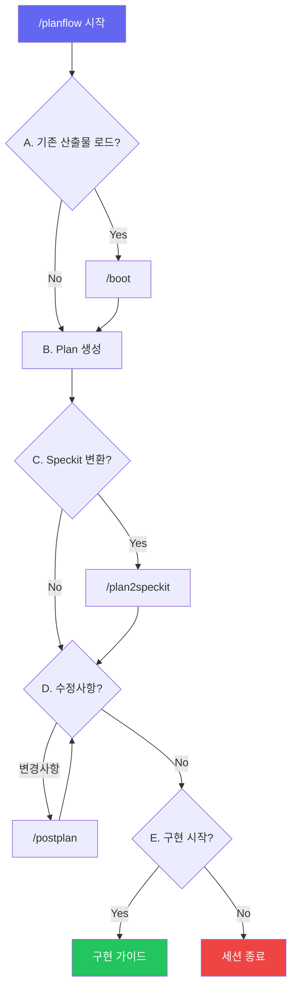

# Claude Code Planflow Skills - 사용자 가이드

## 목차

1. [소개](#소개)
2. [설치](#설치)
3. [빠른 시작](#빠른-시작)
4. [명령어 상세](#명령어-상세)
5. [워크플로우](#워크플로우)
6. [테스트 결과](#테스트-결과)
7. [Speckit 형식](#speckit-형식)
8. [커스터마이징](#커스터마이징)
9. [문제 해결](#문제-해결)

---

## 소개

### Planflow Skills란?

Planflow Skills는 Claude Code에서 사용할 수 있는 커스텀 슬래시 커맨드 패키지입니다. 기능 개발 시 **계획(Plan) → 구조화(Speckit) → 피드백 → 구현** 단계를 대화형으로 진행할 수 있게 해줍니다.

### 주요 특징

- **대화형 워크플로우**: 각 단계에서 yes/no 선택으로 유연하게 진행
- **Speckit 호환**: GitHub Spec Kit 표준 형식 지원
- **모듈화**: 전체 워크플로우 또는 개별 명령어 사용 가능
- **피드백 루프**: 구현 전 계획을 반복적으로 개선

### 왜 Planflow를 사용해야 하나요?

| 기존 방식 | Planflow 사용 |
|-----------|---------------|
| 바로 코딩 시작 → 구조 변경 빈번 | 계획 먼저 → 체계적 구현 |
| 머릿속에만 있는 계획 | 문서화된 plan.md, tasks.md |
| 작업 진행 상황 파악 어려움 | 체크리스트로 진행률 추적 |
| 팀원과 공유 불편 | 표준 형식으로 쉽게 공유 |

---

## 설치

### 요구 사항

- Claude Code CLI 설치됨
- 프로젝트 디렉토리에 쓰기 권한

### 설치 방법

#### 방법 1: 프로젝트별 설치 (권장)

```bash
# 저장소 클론
git clone https://github.com/devload/claude-planflow-skills.git

# 프로젝트에 복사
cp -r claude-planflow-skills/.claude/commands/ /your/project/.claude/commands/
```

#### 방법 2: 전역 설치

```bash
# 홈 디렉토리의 .claude에 복사
cp -r .claude/commands/ ~/.claude/commands/
```

### 설치 확인

Claude Code에서 다음 명령어로 확인:

```
/planflow --help
```

---

## 빠른 시작

### 5분 튜토리얼

1. **프로젝트 디렉토리로 이동**
   ```bash
   cd /path/to/your/project
   ```

2. **Claude Code 실행**
   ```bash
   claude
   ```

3. **Planflow 시작**
   ```
   /planflow user-auth "JWT 기반 사용자 인증 시스템 구현"
   ```

4. **질문에 응답**
   - "기존 산출물 로드할까요?" → `no`
   - (Plan 생성됨)
   - "Speckit으로 변환할까요?" → `yes`
   - "수정할 점 있나요?" → `no`
   - "구현 시작할까요?" → `yes`

5. **구현 시작!**

---

## 명령어 상세

### /planflow

메인 워크플로우 명령어. 전체 계획 프로세스를 대화형으로 진행합니다.

```
/planflow <feature-name> "<설명>"
```

**매개변수**:
- `feature-name`: 기능 이름 (kebab-case, 예: `user-auth`, `payment-system`)
- `설명`: 구현할 기능에 대한 설명

**예시**:
```
/planflow dashboard "관리자 대시보드 with 실시간 통계"
/planflow api-rate-limit "API 요청 제한 기능 구현"
```

**워크플로우 단계**:

| 단계 | 질문 | yes 선택 시 | no 선택 시 |
|------|------|-------------|------------|
| A | 기존 산출물 로드? | /boot 실행 | 바로 진행 |
| B | (Plan 생성) | - | - |
| C | Speckit 변환? | /plan2speckit 실행 | 넘어감 |
| D | 수정사항? | /postplan 실행 | 넘어감 |
| E | 구현 시작? | 가이드 제시 | 종료 |

---

### /boot

기존 스펙과 태스크를 로드하고 요약합니다.

```
/boot [feature-name]
```

**매개변수**:
- `feature-name`: (선택) 특정 기능만 로드. 생략하면 전체 스캔.

**예시**:
```
/boot                  # 모든 feature 로드
/boot user-auth        # user-auth만 로드
```

**출력 예시**:
```
## Loaded Specs Summary

### user-auth
**Plan Summary**: JWT 기반 인증 시스템
**Technical Context**: TypeScript, Express, PostgreSQL
**Tasks**: 3/8 completed (5 pending)
**Next Task**: T-1.4: 토큰 갱신 엔드포인트 구현
```

---

### /plan2speckit

Plan 파일을 Speckit 형식으로 변환합니다.

```
/plan2speckit <feature-name>
```

**매개변수**:
- `feature-name`: (필수) 변환할 기능 이름

**입력**: `plans/<feature>-YYYYMMDD-HHMM.md`

**출력**:
```
specs/<feature>/
├── plan.md      # 기술 계획 문서
└── tasks.md     # 태스크 분류 및 체크리스트
```

---

### /postplan

사용자 피드백을 반영하여 plan.md와 tasks.md를 업데이트합니다.

```
/postplan <feature-name> ["<피드백>"]
```

**매개변수**:
- `feature-name`: (필수) 수정할 기능 이름
- `피드백`: (선택) 변경 요청 내용. 생략하면 대화형으로 입력받음.

**예시**:
```
/postplan user-auth
/postplan user-auth "T-1.2를 프론트엔드와 백엔드로 분리"
/postplan user-auth "Phase 3 삭제"
```

**지원하는 변경 유형**:
- 태스크 추가/삭제/분리/병합
- 의존성 수정
- 기술 스택 변경
- 단계(Phase) 재구성

---

## 워크플로우

### 흐름도



### 전체 흐름도 (텍스트)

```
┌─────────────────────────────────────────────────────────────┐
│                    /planflow 시작                           │
└─────────────────────────────────────────────────────────────┘
                            │
                            ▼
┌─────────────────────────────────────────────────────────────┐
│  A. Pre-Plan Check                                          │
│  "기존 산출물 로드할까요? (yes/no)"                         │
└─────────────────────────────────────────────────────────────┘
         │yes                              │no
         ▼                                 │
   ┌───────────┐                          │
   │  /boot    │                          │
   └───────────┘                          │
         │                                 │
         └────────────┬────────────────────┘
                      ▼
┌─────────────────────────────────────────────────────────────┐
│  B. Plan 생성                                               │
│  - 코드베이스 분석                                          │
│  - 계획 문서 생성                                           │
│  - plans/<feature>-YYYYMMDD-HHMM.md 저장                    │
└─────────────────────────────────────────────────────────────┘
                      │
                      ▼
┌─────────────────────────────────────────────────────────────┐
│  C. Speckit 변환                                            │
│  "specs/<feature>/로 변환할까요? (yes/no)"                  │
└─────────────────────────────────────────────────────────────┘
         │yes                              │no
         ▼                                 │
   ┌─────────────┐                        │
   │/plan2speckit│                        │
   └─────────────┘                        │
         │                                 │
         └────────────┬────────────────────┘
                      ▼
┌─────────────────────────────────────────────────────────────────┐
│  D. 피드백 수집 (반복)                                          │
│  "수정할 점 있나요? (no 또는 변경사항 입력)"                    │
└─────────────────────────────────────────────────────────────────┘
         │변경사항                         │no
         ▼                                 │
   ┌───────────┐                          │
   │ /postplan │──────────────────────────┤
   └───────────┘        (다시 질문)        │
                                          │
                      ┌───────────────────┘
                      ▼
┌─────────────────────────────────────────────────────────────┐
│  E. 구현 시작                                               │
│  "이제 구현을 시작할까요? (yes/no)"                         │
└─────────────────────────────────────────────────────────────┘
         │yes                              │no
         ▼                                 ▼
   ┌───────────────┐                ┌───────────────┐
   │ 구현 가이드   │                │   세션 종료   │
   │ 첫 태스크부터 │                │   저장 완료   │
   └───────────────┘                └───────────────┘
```

### 실제 사용 시나리오

#### 시나리오 1: 새 기능 개발

```
User: /planflow payment "결제 시스템 with Stripe 연동"

Claude: Plan을 생성하기 전에 /boot로 기존 산출물을 로드할까요? (yes/no)
User: no

Claude: [코드베이스 분석 중...]
        [Plan 생성 완료]

        ## Plan Generated: payment
        Saved to: plans/payment-20260104-1530.md

        ### Summary
        Stripe API를 활용한 결제 시스템. 구독 결제, 일회성 결제 지원.

        Plan을 specs/payment/로 변환할까요? (yes/no)
User: yes

Claude: [specs/payment/plan.md 생성]
        [specs/payment/tasks.md 생성]

        수정할 점이 있나요? (no 또는 변경사항 입력)
User: 환불 처리 태스크 추가해줘

Claude: [tasks.md 업데이트]
        T-2.4: 환불 처리 구현 추가됨

        추가로 수정할 점이 있나요?
User: no

Claude: 이제 구현을 시작할까요? (yes/no)
User: yes

Claude: ## Implementation Guide: payment
        Starting with: T-1.1 - Stripe SDK 설정
        File: src/payment/stripe.config.ts
```

#### 시나리오 2: 기존 계획 수정

```
User: /boot payment

Claude: ## Loaded Specs Summary
        ### payment
        **Tasks**: 2/6 completed (4 pending)
        **Next Task**: T-1.3: 결제 서비스 구현

User: /postplan payment "T-1.3을 카드 결제와 계좌이체로 분리"

Claude: ## Changes Applied
        - T-1.3 → T-1.3a: 카드 결제 구현
        - T-1.3 → T-1.3b: 계좌이체 구현
        - 후속 태스크 ID 재정렬
```

---

## 테스트 결과

### 실제 테스트: JWT 인증 기능 구현

`/planflow test-auth "JWT authentication feature"` 명령으로 실제 테스트한 결과입니다.

#### 워크플로우 진행

| 단계 | 질문 | 선택 | 결과 |
|------|------|------|------|
| **Step A** | 기존 산출물 로드? | No | specs/ 비어있어 바로 진행 |
| **Step B** | (Plan 생성) | - | 프로젝트 분석 후 Plan 생성 |
| **Step C** | Speckit 변환? | Yes | plan.md, tasks.md 생성 |
| **Step D** | 수정할 점? | No | 다음 단계로 |
| **Step E** | 구현 시작? | No | 계획 단계 종료 |

#### 생성된 파일

```
plans/
└── test-auth-20260104-1352.md   # 5,181 bytes

specs/
└── test-auth/
    ├── plan.md                   # 2,839 bytes
    └── tasks.md                  # 6,441 bytes
```

#### 생성된 Plan 요약

```markdown
# Plan: test-auth

**Date**: 2026-01-04 13:52
**Status**: Draft
**Prompt**: "JWT authentication feature"

## Objectives
- User registration and login
- Access token and refresh token flow
- Token validation middleware
- Secure password hashing
- Token refresh mechanism

## Scope
### In Scope
- User registration endpoint with email/password
- User login endpoint returning JWT tokens
- Authentication middleware for protected routes
- Token refresh endpoint
- Logout functionality

### Out of Scope
- OAuth/social login integration
- Email verification
- Password reset flow
```

#### 생성된 Tasks 요약

| Phase | 태스크 수 | 주요 내용 |
|-------|----------|-----------|
| Phase 1: Foundation Setup | 4 | TypeScript 설정, Prisma, Express 서버 |
| Phase 2: Core Authentication | 5 | 회원가입, 로그인, JWT 생성, 검증 |
| Phase 3: Token Management | 4 | 미들웨어, 토큰 갱신, 로그아웃 |
| Phase 4: Testing & Security | 4 | 단위/통합 테스트, Rate Limiting |
| **Total** | **17** | |

#### Critical Path

```
T-1.1 → T-1.2 → T-1.3 → T-2.2 → T-2.4 → T-3.2 → T-3.3 → T-4.2 → T-4.4
```

#### 검증된 기능

- ✅ `/boot` - specs 디렉토리 스캔 및 요약 출력
- ✅ `/planflow` - 대화형 yes/no 질문 순서대로 진행
- ✅ Plan 파일 타임스탬프 자동 생성 (YYYYMMDD-HHMM 형식)
- ✅ `/plan2speckit` - Speckit 형식 변환 (plan.md + tasks.md)
- ✅ 태스크 ID, Dependencies, Validation 자동 생성
- ✅ Critical Path 분석 및 병렬 실행 가능 태스크 마킹 `[P]`

---

## 복잡한 테스트: 기존 스펙 참조

`/planflow user-profile "User profile management with avatar upload"` 명령으로 기존 test-auth 스펙을 참조하는 복잡한 테스트입니다.

#### 워크플로우 진행

| 단계 | 질문 | 선택 | 결과 |
|------|------|------|------|
| **Step A** | 기존 산출물 로드? | Yes | test-auth 스펙 로드됨 |
| **Step A+** | 기존 스펙 참조할까요? | Yes | test-auth 의존성 분석 |
| **Step B** | (Plan 생성) | - | 크로스 기능 의존성 포함 Plan 생성 |
| **Step C** | Speckit 변환? | Yes | plan.md, tasks.md 생성 |

#### 생성된 파일

```
plans/
└── user-profile-20260104-1410.md

specs/
├── test-auth/          # 기존 스펙 (참조됨)
│   ├── plan.md
│   └── tasks.md
└── user-profile/       # 새로 생성
    ├── plan.md
    └── tasks.md
```

#### 생성된 Tasks 요약

| Phase | 태스크 수 | 주요 내용 |
|-------|----------|-----------|
| Phase 1: Database & Types | 3 | User 모델 확장, DTO, zod 스키마 |
| Phase 2: Profile CRUD | 4 | 프로필 서비스, 라우트, 검증, 테스트 |
| Phase 3: Avatar Infrastructure | 5 | Multer 설정, 스토리지, Sharp 이미지 처리 |
| Phase 4: Avatar Endpoints | 4 | 업로드, 삭제, URL 생성, 정리 작업 |
| Phase 5: Testing & Polish | 4 | 통합 테스트, 에러 처리, Rate Limiting |
| **Total** | **20** | |

#### 크로스 기능 의존성

| user-profile 태스크 | 의존 대상 | 설명 |
|---------------------|-----------|------|
| T-2.2 | test-auth T-3.1 | 인증 미들웨어 사용 |
| T-5.4 | test-auth T-4.3 | Rate limiting 미들웨어 재사용 |
| T-1.1 | test-auth T-1.3 | User 모델 확장 |

#### 검증된 추가 기능

- ✅ 기존 specs 로드 및 요약 (`/boot`)
- ✅ 기존 스펙 참조 여부 추가 질문
- ✅ 크로스 기능 의존성 자동 식별
- ✅ 20개 태스크, 5개 페이즈 복잡한 Plan 생성
- ✅ 기존 인프라(인증 시스템) 연결 관리

---

## Speckit 형식

### plan.md 구조

```markdown
# Plan: <feature-name>

- **Branch**: feature/<feature-name>
- **Date**: YYYY-MM-DD
- **Spec**: specs/<feature>/spec.md

## Summary
[핵심 목표 및 접근 방식 요약]

## Technical Context
| Aspect | Value |
|--------|-------|
| Language/Version | TypeScript 5.x |
| Primary Dependencies | express, prisma |
| Storage | PostgreSQL |
| Testing | Jest |

## Project Structure
[변경될 파일/디렉토리 구조]

## Architecture Notes
[아키텍처 결정 사항]
```

### tasks.md 구조

```markdown
# Tasks: <feature-name>

Generated from: plans/<feature>-YYYYMMDD-HHMM.md
Date: YYYY-MM-DD

## Phase 1: [단계명]

### T-1.1: [태스크 제목]
- **Description**: [상세 설명]
- **Files**: `path/to/file.ts`
- **Dependencies**: None
- **Validation**: [완료 확인 방법]

### T-1.2: [태스크 제목] [P]
- **Description**: [상세 설명]
- **Files**: `path/to/file.ts`
- **Dependencies**: T-1.1
- **Validation**: [완료 확인 방법]

---

## Checklist
- [ ] T-1.1: [태스크 제목]
- [ ] T-1.2: [태스크 제목]
```

### 태스크 ID 규칙

- 형식: `T-<phase>.<sequence>`
- 예시: `T-1.1`, `T-2.3`, `T-3.1`
- `[P]` 마커: 병렬 실행 가능한 태스크

### 의존성 표기

```markdown
- **Dependencies**: None                    # 의존성 없음
- **Dependencies**: T-1.1                   # 단일 의존
- **Dependencies**: T-1.1, T-1.2            # 복수 의존
```

---

## 커스터마이징

### 명령어 파일 수정

각 명령어 파일은 `.claude/commands/`에 위치합니다:

```
.claude/commands/
├── boot.md
├── plan2speckit.md
├── planflow.md
└── postplan.md
```

### Frontmatter 수정

```yaml
---
description: "명령어 설명"
argument-hint: "<필수> [선택]"
allowed-tools: ["Read", "Write", "Edit", "Bash"]
---
```

### 템플릿 수정

각 명령어 파일 내의 마크다운 템플릿을 수정하여 출력 형식을 변경할 수 있습니다.

---

## 문제 해결

### 자주 발생하는 문제

#### 1. "Command not found"

```
Error: Unknown command /planflow
```

**해결**: `.claude/commands/` 디렉토리가 올바른 위치에 있는지 확인

```bash
ls .claude/commands/
# 출력: boot.md  plan2speckit.md  planflow.md  postplan.md
```

#### 2. "No plan found"

```
No plan found for feature 'xyz'. Please run /planflow first.
```

**해결**: `/planflow`를 먼저 실행하거나, `plans/` 디렉토리에 해당 feature의 plan 파일이 있는지 확인

#### 3. "Feature not found"

```
Error: Feature 'xyz' not found in specs/
```

**해결**: `/plan2speckit`으로 먼저 변환하거나, `specs/xyz/` 디렉토리 존재 여부 확인

### 디렉토리 구조 확인

```bash
# 예상 구조
your-project/
├── .claude/
│   └── commands/
│       ├── boot.md
│       ├── plan2speckit.md
│       ├── planflow.md
│       └── postplan.md
├── plans/
│   └── feature-YYYYMMDD-HHMM.md
└── specs/
    └── feature/
        ├── plan.md
        └── tasks.md
```

### 로그 확인

Claude Code 디버그 모드로 실행:

```bash
claude --debug
```

---

## 부록

### 관련 링크

- [GitHub Spec Kit](https://github.com/github/spec-kit)
- [Claude Code 공식 문서](https://docs.anthropic.com/claude-code)

### 라이센스

MIT License

### 기여하기

1. Fork the repository
2. Create feature branch
3. Submit pull request

---

*이 문서는 Claude Code Planflow Skills v1.0 기준으로 작성되었습니다.*
